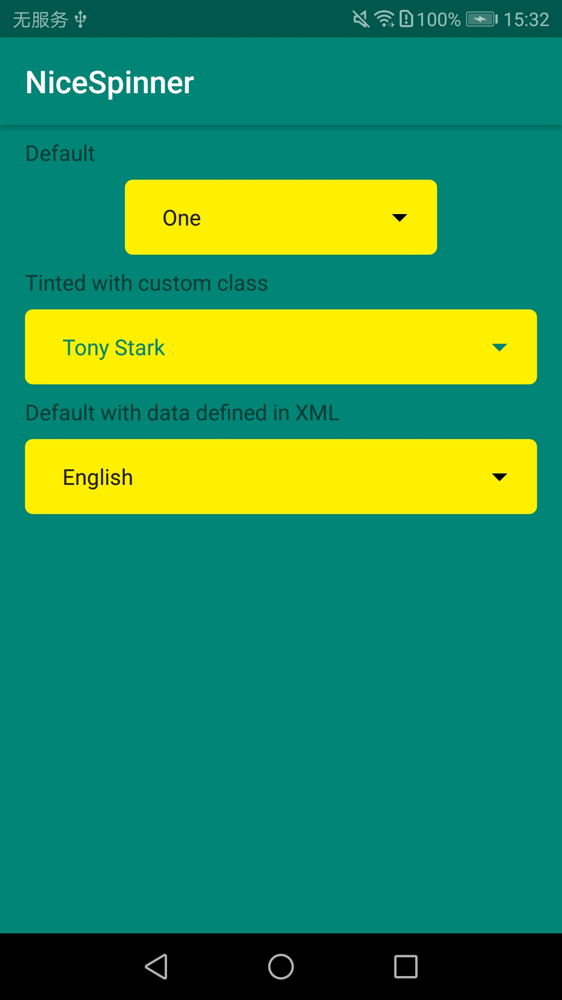
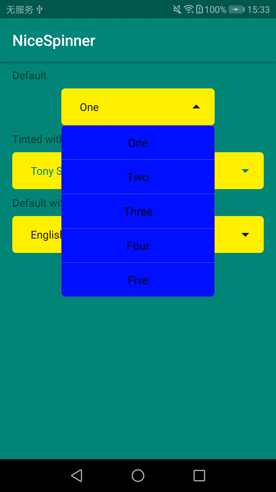

# NiceSpinnerExample

 对[nice-spinner](https://github.com/arcadefire/nice-spinner) 学习和修改
 
 ##### 修改记录
 - 改变背景为弧度背景
 - 添加可见选项数
 
 ##### 问题记录
 - 可见选项数目首次点击时未生效
 
 ##### module
 
 - library
   该模块是最新的nice-spinner更改的
 - oldlibrary
   该模块是nice-spinner的1.3.2版本的代码更改
 
   
 
 